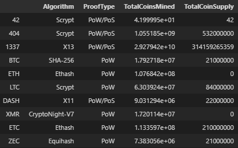
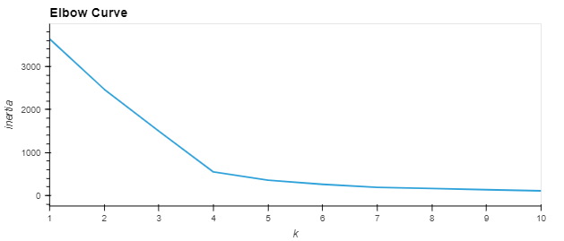
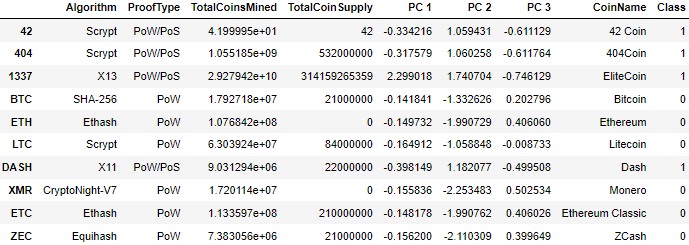
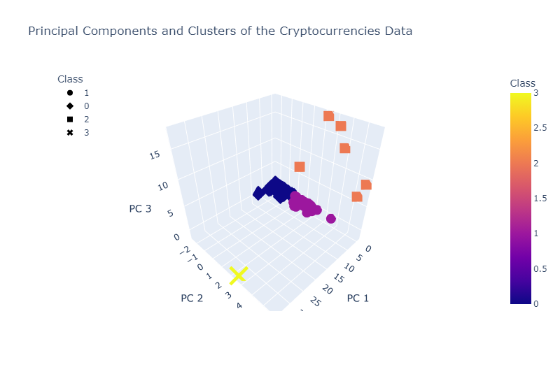
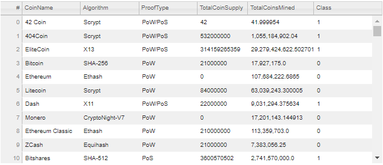
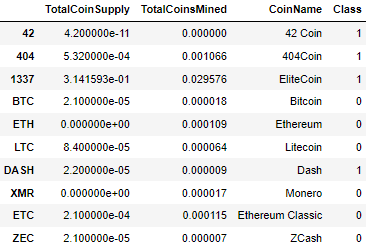
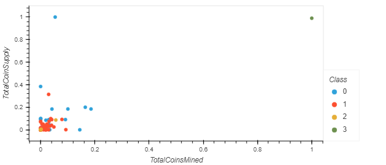

# Cryptocurrencies
This project focused on the application of various unsupervised Machine Learning models and clustering algorithms for performing efficient ETL and solving a real-world case study based on systematic statistical reasoning.

## Table of Contents

- [Overview of Project](#overview-of-project)
  - [Resources](#resources)
  - [Challenge Overview](#challenge-overview)
  - [GitHub Repo Branches](#github-repo-branches)
- [Part 1: Preprocessing the Data for PCA](#part-1-preprocessing-the-data-for-pca)
  - [Cleaning *crypto_df* DataFrame](#cleaning-crypto_df-dataframe)
  - [Encoding Categorical Columns](#encoding-categorical-columns)
- [Part 2: Reducing Data Dimensions Using PCA](#part-2-reducing-data-dimension-using-pca)
- [Part 3: Clustering Cryptocurrencies Using K-means](#part-3-clustering-cryptocurrencies-using-k-means)
- [Part 4: Visualizing Cryptocurrencies Results](#part-4-visualizing-cryptocurrencies-results)
- [Summary](#summary)
- [References](#references)

## Overview of Project

This project and Module 19 assignment focused on cultivating knowledge and skills in data preparation, statistical reasoning, and machine learning (ML), which were required for solving a real-world challenge: effective classification for cryptocurrencies. During the completion of this project we mainly leveraged the powerful features offered by [Scikit-learn User Guide - Unsupervised Learning](https://scikit-learn.org/stable/unsupervised_learning.html) and their supporting packages/libraries/dependencies that let us explore, train, and study various unsupervised learning models and resources, such as preprocessing, standardization, decomposition, and clustering methods.

### Resources

- Source code: [crypto_clustering.ipynb](./crypto_clustering.ipynb).
- Source data: [crypto_data.csv](./Resources/crypto_data.csv).
- Image file: png files.
- Software: [Pandas User Guide](https://pandas.pydata.org/pandas-docs/stable/user_guide/index.html#user-guide), [Scikit-learn User Guide - Unsupervised Learning](https://scikit-learn.org/stable/unsupervised_learning.html), [hvPlot](https://hvplot.holoviz.org/user_guide/Introduction.html).

### Challenge Overview

Below is the outline of our deliverables and a written report for presenting our results and analysis summary. It consists of four technical analysis deliverables, including visualizations and a summary of our study on cryptocurrency analysis.

- ☑️ Part 1: Preprocessing the Data for PCA.
- ☑️ Part 2: Reducing Data Dimensions Using PCA.
- ☑️ Part 3: Clustering Cryptocurrencies Using K-means.
- ☑️ Part 4: Visualizing Cryptocurrencies Results.
- ☑️ A Summary on Code Snippets for Cryptocurrency Analysis (this ["README.md"](./README.md)).

### GitHub Repo Branches

All required deliverables are committed in this GitHub repo as outlined below.  

main branch  
|&rarr; [./README.md](./README.md)  
|&rarr; [./crypto_clustering.ipynb](./crypto_clustering.ipynb)  
|&rarr; ./Resources/  
  &emsp; |&rarr; [./Resources/crypto_data.csv](./Resources/crypto_data.csv)  
|&rarr; ./Data/  
  &emsp; |&rarr; [./Data/cleaned_crypto_df.png](./Data/cleaned_crypto_df.png)  
  &emsp; |&rarr; [./Data/clustered_df.png](./Data/clustered_df.png))  
  &emsp; |&rarr; [./Data/hvplot_elbow_curve.png](./Data/hvplot_elbow_curve.png)  
  &emsp; |&rarr; [./Data/hvplot_3DScatter_pca_and_clusters_clustered_df.png](./Data/hvplot_3DScatter_pca_and_clusters_clustered_df.png)  
  &emsp; |&rarr; [./Data/clustered_df_hvplot_table.png](./Data/clustered_df_hvplot_table.png)  
  &emsp; |&rarr; [./Data/plot_df.png](./Data/plot_df.png)  
  &emsp; |&rarr; [./Data/hvplot_scatter_rescaled_plot_df.png](./Data/hvplot_scatter_rescaled_plot_df.png)  

## Part 1: Preprocessing the Data for PCA

Using our knowledge of the Python Pandas and scikit-learn preprocessing libraries, we read in the csv data as a DataFreame, cleaned the data, filtered a few unrelated entries, reshaped the original dataset, and performed the standardization and scaling processes. The source code can be referred in [crypto_clustering.ipynb](./crypto_clustering.ipynb), which I used to efficiently accomplish the data cleaning and preprocessing steps. The cleaned data were later passed down to the principal component analysis step ([sklearn.decomposition.PCA](https://scikit-learn.org/stable/modules/generated/sklearn.decomposition.PCA.html)), in which we optimized the dimension of our dataset.

### Cleaning *crypto_df* DataFrame

After importing the required dependencies, we read the csv data as a DataFrame called *crypto_df*. The transformation from the original dataset to the standardized and scaled dataset is illustrated below.

- **1252** rows and **6** columns at the start of data preprocessing steps.
- `crypto_df.IsTrading` column contained **108** False and **1144** True rows of Boolean entries. The neat Boolean indexing in Pandas could then be used to filter the True entries exclusively, often in combination with `loc[]`.
- **508** rows containing any null (NaN) values were deleted. Some of these rows had already been removed in the previous step.
- **153** rows where coins are mined were removed. We only run our unsupervised learning model on data where coins are mined in this project.
- The shape of the cleaned *crypto_df* DataFrame was **(532, 4)** at the end of data preprocessing steps. The first ten rows are shown in **Table 1**.

```
# Initial imports
import pandas as pd
import hvplot.pandas
from pathlib import Path
import plotly.express as px
from sklearn.preprocessing import StandardScaler, MinMaxScaler
from sklearn.decomposition import PCA
from sklearn.cluster import KMeans
import warnings
warnings.filterwarnings('ignore')

# Load the crypto_data.csv dataset.
file_path = Path('./Resources/crypto_data.csv')
crypto_df = pd.read_csv(file_path, index_col=0)

# Keep all the cryptocurrencies that are being traded (using boolean indexing)
crypto_df = crypto_df.loc[crypto_df.IsTrading]

# Remove the "IsTrading" column. 
crypto_df = crypto_df.drop(columns=['IsTrading'])

# Remove rows that have at least 1 null value (default: axis=0, how='any')
crypto_df = crypto_df.dropna(axis=0, how='any')

# Keep the rows where coins are mined (using boolean indexing)
crypto_df = crypto_df[crypto_df.TotalCoinsMined > 0]

# Create a new DataFrame that holds only the cryptocurrencies names.
namecol = ['CoinName']
name_df = crypto_df[namecol]
display(name_df.shape, name_df[0:5])

# Drop the 'CoinName' column since it's not going to be used on the clustering algorithm.
crypto_df = crypto_df.drop(columns=namecol)
display(crypto_df.shape, crypto_df.head(10))
```

**Table 1. First 10 rows of the cleaned *crypto_df* DataFrame.**  


### Encoding Categorical Columns

We used Pandas `get_dummies()` for encoding the categorical columns, which contained string values, and then standardized and scaled the data by using the StandardScaler method. Data were rescaled to a mean of 0 and standard deviation of 1 by the StandardScaler method.

```
# Use get_dummies() to create variables for text features.
X = pd.get_dummies(crypto_df, columns=['Algorithm', 'ProofType'])

# Standardize the data with StandardScaler().
scaler = StandardScaler()

# Fit and transform features (1 step)
X_scaled = scaler.fit_transform(X)
```

## Part 2: Reducing Data Dimensions Using PCA

We used the following code snippet to reduce the dimension of our dataset to three principal components and created a new DataFrame called `pcs_df`.

```
# Using PCA to reduce dimension to three principal components.
# Globally set seed number as 1 for consistency (change seedn to 0, etc. to experiment)
seedn = 1
pca = PCA(n_components=3, random_state=seedn)
X_pca = pca.fit_transform(X_scaled)

# Create a DataFrame with the three principal components.
pcs_df = pd.DataFrame(X_pca, columns=['PC 1', 'PC 2', 'PC 3'], index=crypto_df.index)
```

## Part 3: Clustering Cryptocurrencies Using K-means

We used the following code snippet to create an elbow curve for finding the best value for K. The elbow curve suggested that the optimal value for K was 4 as depicted in Fig. 1. We then fed this K value to create our model using the KMeans method. We merged the *pcs_df* DataFrame and the results from the KMeans model with *crypto_df* DataFrame. The first ten rows of the resulting DataFrame called *clustered_df* are shown in **Table 2**.

```
def get_clusters(k, data):
    # # Create a copy of the DataFrame
    # data = data.copy()
    # Initialize the K-Means model
    model = KMeans(n_clusters=k, random_state=seedn)
    # Fit the model
    model.fit(data)
    # Predict clusters and return the model and predicted clusters
    pred = model.predict(data)
    return (model, pred)

# Running K-Means with `k=4`
K = 4
model, pred_k4 = get_clusters(K, pcs_df)

# Create a new DataFrame including predicted clusters and cryptocurrencies features.
# Concatentate the crypto_df and pcs_df DataFrames on the same columns.
dfs = [crypto_df, pcs_df]
clustered_df = pd.concat(dfs, axis=1)

#  Add a new column, "CoinName" to the clustered_df DataFrame that holds the names of the cryptocurrencies. 
clustered_df['CoinName'] = name_df

#  Add a new column, "Class" to the clustered_df DataFrame that holds the predictions.
clustered_df["Class"] = model.labels_

# Print the shape of the clustered_df
print(clustered_df.shape)
clustered_df.head(10)
```

  
**Fig. 1 Elbow curve of the decomposed cryptocurrencies data.**

**Table 2. First 10 rows of the cleaned *clustered_df* DataFrame.**  


## Part 4: Visualizing Cryptocurrencies Results

The visualization results are illustrated in Fig. 2, **Table 3&ndash;4**, and Fig. 3.

- Fig. 2 shows the 3D-scatter plots of principal components and clusters of the cryptocurrencies data.
- **Table 3** shows the table created by using `hvplot.table` from the *clustered_df* DataFrame.
- **Table 4** shows the *plot_df* DataFrame that was used to graph the scatter plots.
- Fig. 3 shows the scatter plots using the scaled cryptocurrencies data.

  
**Fig. 2 3D-scatter plots of principal components and clusters of the cryptocurrencies data.**

**Table 3. Table created by using `hvplot.table` from the *clustered_df* DataFrame.**  


**Table 4. First 10 rows of the rescaled *plot_df* DataFrame.**  


  
**Fig. 3 Scatter plots of the rescaled *plot_df* DataFrame.**

## Summary

All deliverables have been completed and analyzed according to the assignment requirements, including code refactoring, properly formatted outputs, and quality assurance for ensuring accurate results.

## References

[Pandas User Guide](https://pandas.pydata.org/pandas-docs/stable/user_guide/index.html#user-guide)  
[Scikit-learn User Guide - Unsupervised Learning](https://scikit-learn.org/stable/unsupervised_learning.html)  
[Scikit-learn User Guide: Supervised Learning](https://scikit-learn.org/stable/supervised_learning.html)  
[hvPlot](https://hvplot.holoviz.org/user_guide/Introduction.html)  
